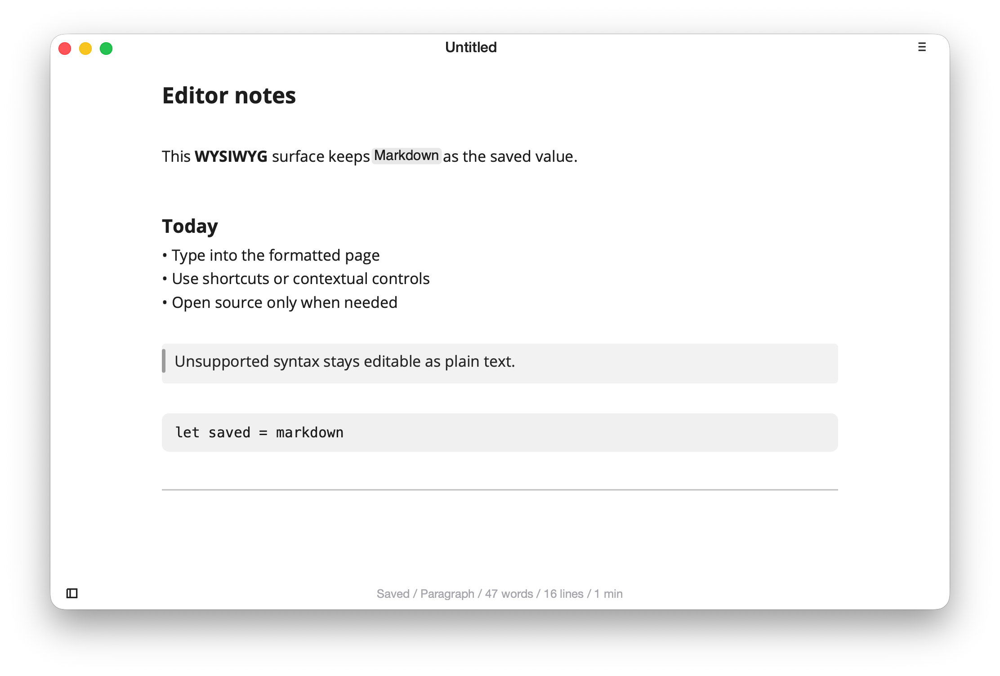

# MoMark (Markdown Editor)

  

The full MoMark documentation lives in
[`README.mbt.md`](./README.mbt.md). The `.mbt.md` variant is the source of
truth for the MoonBit/Chinese-friendly README rendering; the mooncakes.io
docs use the same content.

Source: https://github.com/wzzc-dev/MoMark
